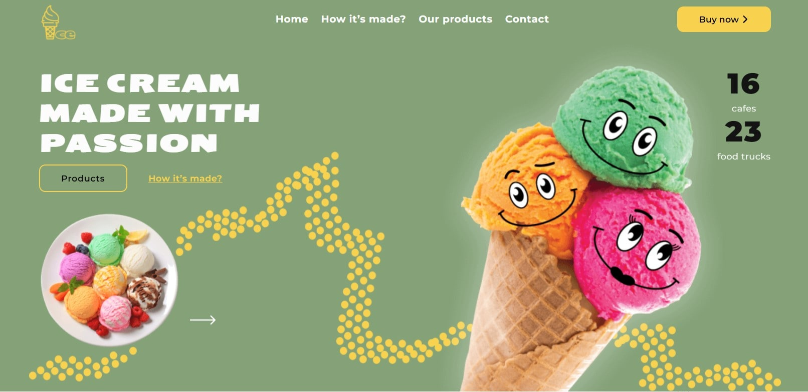
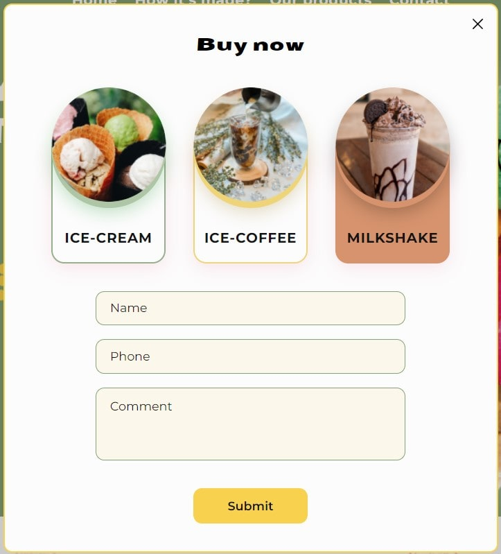
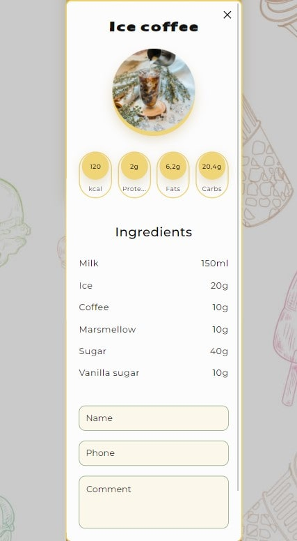

# Ice Cream Website Project
Main Idea: Create a user-friendly, functional, and informative page that is enjoyable to use.

Deadline: 7 days

## Our Team
Team Lead: Nikita Lan
Scrum Master: Yevheniia Melnychenko

Project Participants:

- Kostiantyn Koshyk
- Oleksandr Afanasiev
- Mariia Aleksandrova
- Anna Nastenko
- Oleksii Leshchenko
- Artem Osypov
- Yuliia Ishchenko
- Iryna Neher
- Zakhar Tsarapov
- Anastasiia Kulinych
- Artem Panasiuk

## Key Features of the Project
- Smooth animations and a beautiful interface on load
- Each section is colorful and rich in information
- Additional functionality for users who want to learn more
- Live reviews displayed on the homepage
- Fully responsive design for all devices

